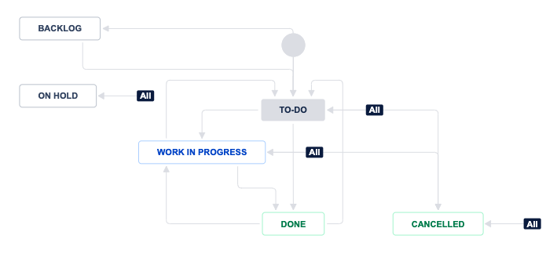
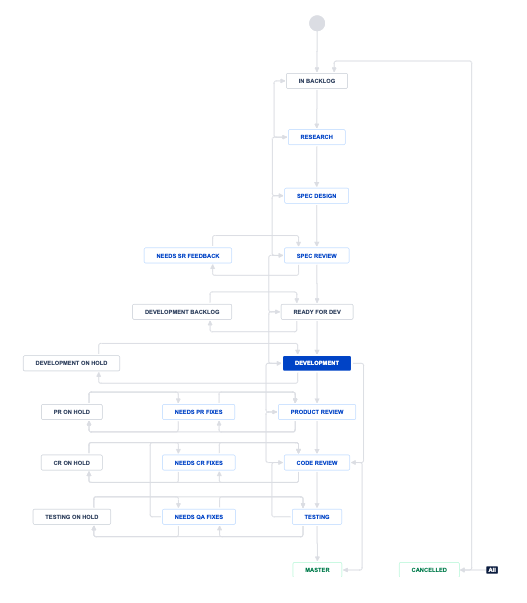
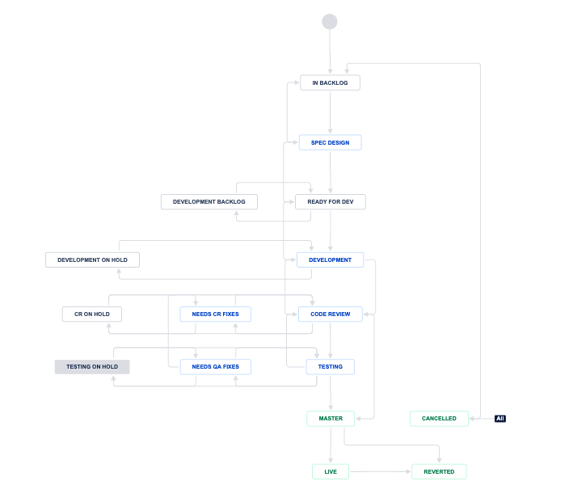
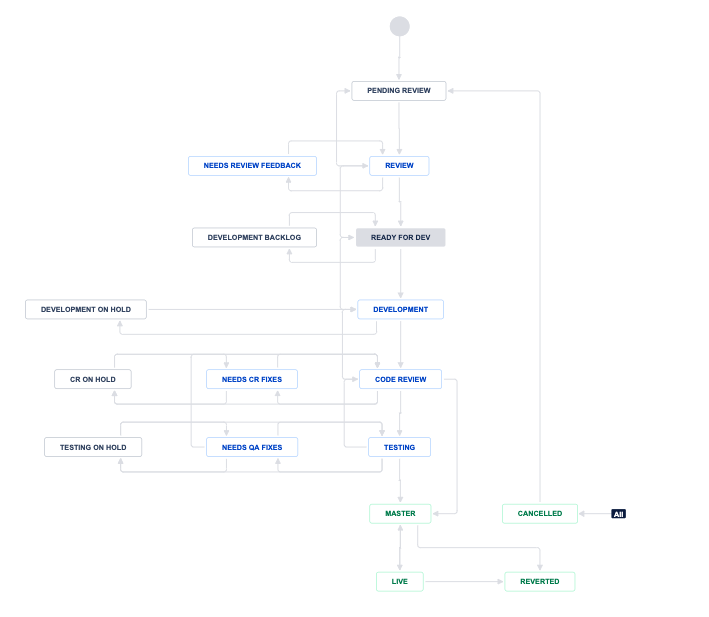

```{r, include = F}
library(ggplot2)
library(tidyr)
library(reshape2)
library(gridExtra)
```

# Introduction to Jira

Thee purpose of this document is to inform its reader about what Jira is and what the most frequently used terms in the jargon of Jira. It is also keeping a snapshot of elementary breakdowns of a snapshot of Jira data.

# Frequently used terms

- **Jira** is a tool for tracking projects, tasks, bugs and all the work that needs to be done.
- **Projects**. A project in Jira is a top-level “container” that groups similar kinds of tasks. And all the development work we do on our Celtra platform is tracked in a single Jira project called AdCreator or shortly MAB. That means that a Jira project is not the same as a project (i.e. new feature) developed for the Celtra platform.
- **Issues/Tickets/Cards** an item which needs to be worked on, which can be of several types. Details below


## Basic anatomy of a ticket

A ticket is consisted of:

- **Description**: what is the purpose of this ticket
- **Status**: Which part of the workflow is the ticket at
- **Assignee**: who is currently working on the ticket, typically changes on each status change.
- **User roles**: People involved in the ticket and their role
- **Watchers**: People getting notified about any changes of the given ticket
- **Labels**: Meta field used for grouping tickets which have something in common, e.g. database changes
- **Components**: Pieces of the product which will affected by the deployment of the issue.
- **Due date**: The date by which the ticket should bee ready for deployment
- **Meta data**: links to specification, sprint(s), status, reason for delay, etc.
- **Linked Issues**: Issues which are directly linked to the given issue with some relation
- **Comments**: The official discussion about the issue
- **Changelog**: Consisting of all changes ever made on the issue: editing each field, changing status, reassigning, etc.

## Issues and issue types

There are 4 different types of issues we are going to consider:

1. **Epic** - is created for each big project, for which we know we will have multiple deploys. Then each Epic has several other issues inside of it, which are deployed separately
    * E.g. introducing a feature on a product level, where the required changes are across the front-end, back-end, and it includes several changes which are not tightly related.
    * **NOTE** In this analysis, we will consider the Epic cards as hubs, i.e. a special type of issue which links together more related issues. As such, we will not analyze its workflow.
    * workflow:

    

2. **New feature or improvement** - as the name suggests, this is an issue type for new features with a single deploy.
    * E.g. introducing a new dimension for breaking down the data.
    * workflow:

    

3. **Internal improvement** - non-feature related improvement with a single deploy.
    * E.g. optimizing a query to get a report faster.
    * workflow:

    

4. **Bug** - reported bugs - product components which have an unexpected/faulty behavior.
    * E.g. the report metrics are faulty.
    * workflow:

    

5. **Subtasks** - 2., 3. and 4. can be broken down into sub-tasks which are deployed together as a whole.
    * E.g. The query optimization requires a change in how a field in the database is stored.
    * The workflows for the sub-tasks in this analysis are considered as identical to the original issues, for simplicity's sake

**Note**: We excluded the issue type **Task** because it has a different workflow from the rest of the listed issue types.

## Development roles

In each  there are

* **Product Manager (PM)**: makes product-related decisions (which are then carried out by the Owner)
* **Owner**: responsible for the smooth execution of the project. He connects all the people and makes sure everything is carried out.
* **Design Lead**: makes design decisions and is often also the main designer
* **Tech Lead**: makes technical decisions, often with the help of product lead
* **Developer**: main developer working on a certain feature/task
* **Quality Assurance (QA) Lead**: main QA tester responsible for the whole project
* **QA Tester**: one of the testers who currently test each task
* **Product Marketing Manager (PMM)**: a product marketing team member who is responsible for rollout and post-deploy activities.
* **Project Manager Officer (PMO)**: responsible for general overview, clearing up the roadblocks and high level communication

## Workflow explained

We use a few different workflows in Jira, from the most basic for *Epics* (To do → In progress → Done) to more complex for *New Feature Improvements*, which includes all the possible states in which an issue can be in. Detailed explanation of this workflow follows:

* **In Backlog**: all the newly created tasks are in this state
* **Research**: in this phase, we research all the open questions
* **Spec design**: includes writing of product and tech specification. It also includes the design phase and other activities needed before development.
* **Spec review**: when specs are written, they are checked by different product managers and senior developers. If something is unclear, the project moves to Needs SR Feedback state.
* **Ready for dev**: When specs are confirmed, the project is moved to ready for development state, when we prioritise it with other projects.
* **Development backlog**: if for some reason the project won’t be started in the next 30 days, we move it to development backlog, where it waits for its turn in development.
* **Development***: here the main work gets done.
* **Development on hold**: this is a temporary, short term (less than 30 days) on hold state. If a developer is working on more projects, one of them is in development and others are in Development on hold state.
* **Product review**: after development is done, the product manager takes a look at the result and checks if fits product requirements
* **Needs PR fixes**: if the product managers find some issues, he gives the project back to the developer to fix them.
* **PR On hold**: as with all other states we need temporary, short term on hold state for a product review as well
* **Code review***: after product review is done, we check the quality of the written code. This is usually done by more senior developers.
* **Needs CR fixes**: if some issues are found in CR, the project goes to this state
* **CR On hold**: temporary, short term on hold state for CR
* **Testing**: after CR passes, the projects goes to QA for testing.
* **Needs QA fixes**: if some issues are found, this is where the project goes
* **Testing on hold**: temporary, short term on hold state for testing
* **Master**: after testing is complete and all (found) bugs are fixed, the project can be “merged to master branch”. This means that the project is scheduled for the next deploy.
* **Live***: after the project has been deployed, its state changes to Live
* **Reverted**: if for some reason we find additional complications, we decide to revert the whole project
    * Mostly major problems that can’t be fixed with small fixes
* **Canceled**: sometimes, for a variety of reasons, a project can be canceled. This can happen at any point during the project.

*mandatory steps

## Priorities explained

As expected, not all issues are worked on with the same priority. For this purpose we distinguish among the following priorities:

1. **Blocker** - the system is not working and clients are affected or the development process is severely disrupted. All hands on deck.
2. **Critical** - the system is affected and if not resolved may escalate to a blocker
3. **Major** - the issue affects the clients, and should be pushed forward asap
4. **Minor** - the need of this feature is not affecting nobody
5. **Trivial** - the changes required are not that important nor complex to work on

# General overview

In this section, we present a high level overview of how many issues there are and how they are distributed among types, priorities and resolved status.

## Breakdown by issue type

```{r issueTypes, echo = F, results = 'hide'}
breakdownByType <- read.csv(file="../basic_stats/by_type.csv")

priorityTypes <- ggplot(breakdownByType) +
      geom_bar(aes(Issue.type, Count), stat = "identity") +
      geom_bar(aes(Issue.type, Count, fill=Resolved), stat = "identity", position = "dodge") +
      xlab("Issue type") +
      ylab("Count")
priorityTypes
```

## Breakdown by priority

```{r issuePriority, echo = F, results = 'hide'}

breakdownByPriority <- read.csv(file="../basic_stats/by-priority.csv")

issuePriority <- ggplot(breakdownByPriority) +
      geom_bar(aes(Issue.priority, Count), stat = "identity") +
      geom_bar(aes(Issue.priority, Count, fill=Resolved), stat = "identity", position = "dodge") +
      xlab("Issue priority") + ylab("Count")
issuePriority
```

## Overdue issues

|Priority|#Issues overdue|Avg days overdue|
|---|---|---|
|Blocker|/|/|
|Critical|4|46.50|
|Major|25|155.12|
|Minor|19|59.95|
|Trivial|/|/|

# Resolved issues breakdown

```{r, echo = F, results = 'hide'}
resolvedIssues <- read.csv(file = "../basic_stats/resolved-issues.csv")
```
## Watch count
### By issue type
```{r watchHistograms, echo = F, results = 'hide'}
issueTypes <- unique(resolvedIssues$Issue.Type)
plots <- list()
for (type in issueTypes) {
  data <- resolvedIssues[resolvedIssues$Issue.Type == type,]
  plots[[type]] <- ggplot(data) +
    geom_histogram(aes(x = Watch.Count), binwidth = 1, color="black", fill="red") +
    # scale_x_continuous(breaks = seq(0, 35, 1), labels = seq(0, 35, 1)) +
    ylab("Issue count") +
    xlab("People watching") +
    ggtitle(paste0(type, ", (", nrow(data), ")")) +
    theme(plot.title = element_text(hjust = 0.5))
}

n <- length(plots)
nCol <- floor(sqrt(n))
do.call("grid.arrange", c(plots, ncol=nCol))
```

### By priority
```{r priprotyWatch, echo = F, results = 'hide'}
priorityTypes <- sort(unique(resolvedIssues$Priority))
plots <- list()
for (type in priorityTypes) {
  data <- resolvedIssues[resolvedIssues$Priority == type,]
  plots[[type]] <- ggplot(data) +
    geom_histogram(aes(x = Watch.Count), binwidth = 1, color="black", fill="red") +
    # scale_x_continuous(breaks = seq(0, 35, 1), labels = seq(0, 35, 1)) +
    ylab("Issue count") +
    xlab("People watching") +
    ggtitle(paste0(type, ", (", nrow(data), ")")) +
    theme(plot.title = element_text(hjust = 0.5))
}

n <- length(plots)
nCol <- floor(sqrt(n))
do.call("grid.arrange", c(plots, ncol=nCol))
```

## Comments
### By issue type
```{r commentHistograms, echo = F, results = 'hide'}
issueTypes <- unique(resolvedIssues$Issue.Type)
plots <- list()
for (type in issueTypes) {
  data <- resolvedIssues[resolvedIssues$Issue.Type == type,]
  plots[[type]] <- ggplot(data) +
    geom_histogram(aes(x = Comments.Count), binwidth = 5, color="black", fill="red") +
    # scale_x_continuous(breaks = seq(0, 35, 1), labels = seq(0, 35, 1)) +
    ylab("Issue count") +
    xlab("Comments count") +
    ggtitle(paste0(type, ", (", nrow(data), ")")) +
    theme(plot.title = element_text(hjust = 0.5))
}

n <- length(plots)
nCol <- floor(sqrt(n))
do.call("grid.arrange", c(plots, ncol=nCol))
```

### By priority
```{r priorityComment, echo = F, results = 'hide'}
priorityTypes <- sort(unique(resolvedIssues$Priority))
plots <- list()
for (type in priorityTypes) {
  data <- resolvedIssues[resolvedIssues$Priority == type,]
  plots[[type]] <- ggplot(data) +
    geom_histogram(aes(x = Comments.Count), binwidth = 5, color="black", fill="red") +
    # scale_x_continuous(breaks = seq(0, 35, 1), labels = seq(0, 35, 1)) +
    ylab("Issue count") +
    xlab("Comments count") +
    ggtitle(paste0(type, ", (", nrow(data), ")")) +
    theme(plot.title = element_text(hjust = 0.5))
}

n <- length(plots)
nCol <- floor(sqrt(n))
do.call("grid.arrange", c(plots, ncol=nCol))
```

## Changelog items

### By issue type
```{r changelogHistograms, echo = F, results = 'hide'}
issueTypes <- unique(resolvedIssues$Issue.Type)
plots <- list()
for (type in issueTypes) {
  data <- resolvedIssues[resolvedIssues$Issue.Type == type,]
  plots[[type]] <- ggplot(data) +
    geom_histogram(aes(x = Changelog.Count), binwidth = 10, color="black", fill="red") +
    # scale_x_continuous(breaks = seq(0, 35, 1), labels = seq(0, 35, 1)) +
    ylab("Issue count") +
    xlab("Changelog count") +
    ggtitle(paste0(type, ", (", nrow(data), ")")) +
    theme(plot.title = element_text(hjust = 0.5))
}

n <- length(plots)
nCol <- floor(sqrt(n))
do.call("grid.arrange", c(plots, ncol=nCol))
```

### By priority
```{r priorityChangelog, echo = F, results = 'hide'}
priorityTypes <- sort(unique(resolvedIssues$Priority))
plots <- list()
for (type in priorityTypes) {
  data <- resolvedIssues[resolvedIssues$Priority == type,]
  plots[[type]] <- ggplot(data) +
    geom_histogram(aes(x = Changelog.Count), binwidth = 10, color="black", fill="red") +
    # scale_x_continuous(breaks = seq(0, 35, 1), labels = seq(0, 35, 1)) +
    ylab("Issue count") +
    xlab("Changelog count") +
    ggtitle(paste0(type, ", (", nrow(data), ")")) +
    theme(plot.title = element_text(hjust = 0.5))
}

n <- length(plots)
nCol <- floor(sqrt(n))
do.call("grid.arrange", c(plots, ncol=nCol))
```


## Days to resolve

### By issue type
```{r dtrTypeHistograms, echo = F, results = 'hide'}
issueTypes <- unique(resolvedIssues$Issue.Type)
plots <- list()
for (type in issueTypes) {
  data <- resolvedIssues[resolvedIssues$Issue.Type == type,]
  plots[[type]] <- ggplot(data) +
    geom_histogram(aes(x = Days.to.resolve), binwidth = 25, color="black", fill="red") +
    # scale_x_continuous(breaks = seq(0, 35, 1), labels = seq(0, 35, 1)) +
    ylab("Issue count") +
    xlab("Days to resolve") +
    ggtitle(paste0(type, ", (", nrow(data), ")")) +
    theme(plot.title = element_text(hjust = 0.5))
}

n <- length(plots)
nCol <- floor(sqrt(n))
do.call("grid.arrange", c(plots, ncol=nCol))
```


### By priority
```{r dtrPriorityHistograms, echo = F, results = 'hide'}
priorityTypes <- sort(unique(resolvedIssues$Priority))
plots <- list()
for (type in priorityTypes) {
  data <- resolvedIssues[resolvedIssues$Priority == type,]
  plots[[type]] <- ggplot(data) +
    geom_histogram(aes(x = Days.to.resolve), binwidth = 25, color="black", fill="red") +
    # scale_x_continuous(breaks = seq(0, 35, 1), labels = seq(0, 35, 1)) +
    ylab("Issue count") +
    xlab("Days to resolve") +
    ggtitle(paste0(type, ", (", nrow(data), ")")) +
    theme(plot.title = element_text(hjust = 0.5))
}

n <- length(plots)
nCol <- floor(sqrt(n))
do.call("grid.arrange", c(plots, ncol=nCol))
```

# Unresolved issues breakdown

```{r, echo = F, results = 'hide'}
unresolvedIssues <- read.csv(file = "../basic_stats/unresolved-issues.csv")
```
## Watch count
### By issue type
```{r watchHistogramsUnresolved, echo = F, results = 'hide'}
issueTypes <- unique(unresolvedIssues$Issue.Type)
plots <- list()
for (type in issueTypes) {
  data <- unresolvedIssues[unresolvedIssues$Issue.Type == type,]
  plots[[type]] <- ggplot(data) +
    geom_histogram(aes(x = Watch.Count), binwidth = 1, color="black", fill="red") +
    # scale_x_continuous(breaks = seq(0, 35, 1), labels = seq(0, 35, 1)) +
    ylab("Issue count") +
    xlab("People watching") +
    ggtitle(paste0(type, ", (", nrow(data), ")")) +
    theme(plot.title = element_text(hjust = 0.5))
}

n <- length(plots)
nCol <- floor(sqrt(n))
do.call("grid.arrange", c(plots, ncol=nCol))
```

### By priority
```{r priprotyWatchUnresolved, echo = F, results = 'hide'}
priorityTypes <- sort(unique(unresolvedIssues$Priority))
plots <- list()
for (type in priorityTypes) {
  data <- unresolvedIssues[unresolvedIssues$Priority == type,]
  plots[[type]] <- ggplot(data) +
    geom_histogram(aes(x = Watch.Count), binwidth = 1, color="black", fill="red") +
    # scale_x_continuous(breaks = seq(0, 35, 1), labels = seq(0, 35, 1)) +
    ylab("Issue count") +
    xlab("People watching") +
    ggtitle(paste0(type, ", (", nrow(data), ")")) +
    theme(plot.title = element_text(hjust = 0.5))
}

n <- length(plots)
nCol <- floor(sqrt(n))
do.call("grid.arrange", c(plots, ncol=nCol))
```

## Comments
### By issue type
```{r commentHistogramsUnresolved, echo = F, results = 'hide'}
issueTypes <- unique(unresolvedIssues$Issue.Type)
plots <- list()
for (type in issueTypes) {
  data <- unresolvedIssues[unresolvedIssues$Issue.Type == type,]
  plots[[type]] <- ggplot(data) +
    geom_histogram(aes(x = Comments.Count), binwidth = 5, color="black", fill="red") +
    # scale_x_continuous(breaks = seq(0, 35, 1), labels = seq(0, 35, 1)) +
    ylab("Issue count") +
    xlab("Comments count") +
    ggtitle(paste0(type, ", (", nrow(data), ")")) +
    theme(plot.title = element_text(hjust = 0.5))
}

n <- length(plots)
nCol <- floor(sqrt(n))
do.call("grid.arrange", c(plots, ncol=nCol))
```

### By priority
```{r priorityCommentUnresolved, echo = F, results = 'hide'}
priorityTypes <- sort(unique(unresolvedIssues$Priority))
plots <- list()
for (type in priorityTypes) {
  data <- unresolvedIssues[unresolvedIssues$Priority == type,]
  plots[[type]] <- ggplot(data) +
    geom_histogram(aes(x = Comments.Count), binwidth = 5, color="black", fill="red") +
    # scale_x_continuous(breaks = seq(0, 35, 1), labels = seq(0, 35, 1)) +
    ylab("Issue count") +
    xlab("Comments count") +
    ggtitle(paste0(type, ", (", nrow(data), ")")) +
    theme(plot.title = element_text(hjust = 0.5))
}

n <- length(plots)
nCol <- floor(sqrt(n))
do.call("grid.arrange", c(plots, ncol=nCol))
```

## Changelog items

### By issue type
```{r changelogHistogramsUnresolved, echo = F, results = 'hide'}
issueTypes <- unique(unresolvedIssues$Issue.Type)
plots <- list()
for (type in issueTypes) {
  data <- unresolvedIssues[unresolvedIssues$Issue.Type == type,]
  plots[[type]] <- ggplot(data) +
    geom_histogram(aes(x = Changelog.Count), binwidth = 10, color="black", fill="red") +
    # scale_x_continuous(breaks = seq(0, 35, 1), labels = seq(0, 35, 1)) +
    ylab("Issue count") +
    xlab("Changelog count") +
    ggtitle(paste0(type, ", (", nrow(data), ")")) +
    theme(plot.title = element_text(hjust = 0.5))
}

n <- length(plots)
nCol <- floor(sqrt(n))
do.call("grid.arrange", c(plots, ncol=nCol))
```

### By priority
```{r priorityChangelogUnresolved, echo = F, results = 'hide'}
priorityTypes <- sort(unique(unresolvedIssues$Priority))
plots <- list()
for (type in priorityTypes) {
  data <- unresolvedIssues[unresolvedIssues$Priority == type,]
  plots[[type]] <- ggplot(data) +
    geom_histogram(aes(x = Changelog.Count), binwidth = 10, color="black", fill="red") +
    # scale_x_continuous(breaks = seq(0, 35, 1), labels = seq(0, 35, 1)) +
    ylab("Issue count") +
    xlab("Changelog count") +
    ggtitle(paste0(type, ", (", nrow(data), ")")) +
    theme(plot.title = element_text(hjust = 0.5))
}

n <- length(plots)
nCol <- floor(sqrt(n))
do.call("grid.arrange", c(plots, ncol=nCol))
```


## Days to date

### By issue type
```{r dtrTypeHistogramsUnresolved, echo = F, results = 'hide'}
issueTypes <- unique(unresolvedIssues$Issue.Type)
plots <- list()
for (type in issueTypes) {
  data <- unresolvedIssues[unresolvedIssues$Issue.Type == type,]
  plots[[type]] <- ggplot(data) +
    geom_histogram(aes(x = Days.to.date), binwidth = 50, color="black", fill="red") +
    # scale_x_continuous(breaks = seq(0, 35, 1), labels = seq(0, 35, 1)) +
    ylab("Issue count") +
    xlab("Days to date") +
    ggtitle(paste0(type, ", (", nrow(data), ")")) +
    theme(plot.title = element_text(hjust = 0.5))
}

n <- length(plots)
nCol <- floor(sqrt(n))
do.call("grid.arrange", c(plots, ncol=nCol))
```


### By priority
```{r dtrPriorityHistogramsUnresolved, echo = F, results = 'hide'}
priorityTypes <- sort(unique(unresolvedIssues$Priority))
plots <- list()
for (type in priorityTypes) {
  data <- unresolvedIssues[unresolvedIssues$Priority == type,]
  plots[[type]] <- ggplot(data) +
    geom_histogram(aes(x = Days.to.date), binwidth = 50, color="black", fill="red") +
    # scale_x_continuous(breaks = seq(0, 35, 1), labels = seq(0, 35, 1)) +
    ylab("Issue count") +
    xlab("Days to date") +
    ggtitle(paste0(type, ", (", nrow(data), ")")) +
    theme(plot.title = element_text(hjust = 0.5))
}

n <- length(plots)
nCol <- floor(sqrt(n))
do.call("grid.arrange", c(plots, ncol=nCol))
```
